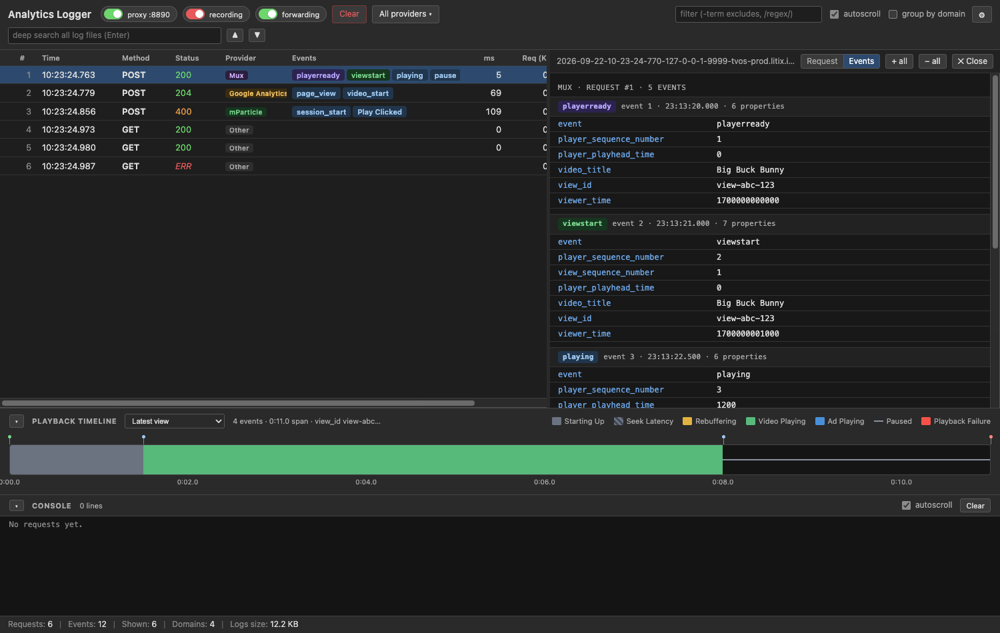

# Analytics Logger

Local HTTP proxy + viewer. It sits between a client (a Roku, a web player, a smart TV, any app or device you can point at a URL) and the internet, forwards every request upstream unchanged, writes the full request/response pair to disk as JSON, and shows the capture live — in a desktop app or in any browser.

One grid: a row per **HTTP request** (any traffic — Charles-style domain tree, sortable/resizable/hideable columns, request/response detail with JSON trees, replay, response rewriting, body editing, HAR export), and under each request the **player analytics events** it carried, decoded with real property names, plus a Mux-style playback timeline. Providers:

  - **Mux** (`*.litix.io`, or any host carrying Mux-shaped beacons) — minified property names are decoded (`pcycd` → `player_country_code`).
  - **Google Analytics** (`google-analytics.com`, `analytics.google.com`) — GA4 gtag (`/g/collect`, one event per body line), GA4 Measurement Protocol (`/mp/collect` JSON) and Universal Analytics (`/collect`, `/batch`); short keys are expanded (`en` → `event_name`, `cid` → `client_id`, `ep.*` event params, `up.*` user properties).
  - **mParticle** (`*.mparticle.com`) — v3 batches (`events[].event_type/data`) and legacy v2 batches (`msgs[]`, e.g. the Roku SDK; `dt`/`n`/`et`/`attrs` are expanded).
  - **Other** — anything else still gets one event row per request, with the URL, query and JSON body flattened into properties.



```
client / device ──► Analytics Logger proxy (0.0.0.0:8889) ──► upstream (litix.io, an API, a CDN …)
(Roku, web, TV)          │
                         ├── logs/   (one JSON file per request)
                         └── GUI     (http://localhost:8080)
```

The runtime code has zero dependencies (Node.js built-ins only); Electron and electron-builder are dev dependencies used to run and package the desktop app.

## How requests are routed

The proxy is **not** a `CONNECT`-style system proxy. The upstream URL is embedded in the request path, after a configurable **Client URL prefix** (default `/;`):

```
http://<your-LAN-IP>:8889/;https://tvos-prod.litix.io/…
                         └┬┘└──────────┬─────────────┘
                       prefix      upstream URL
```

Only the *path* portion of the prefix is matched, so it doesn't matter which local IP or hostname the client used to reach the proxy. Set the prefix to an empty string to treat the entire request URL as the upstream (classic absolute-form proxy requests).

Some SDKs can only be given a **base URL** and append their own path (the mParticle Roku SDK posts to `<base>/v2/<key>/events`). For those, use a **path route** instead of the prefix: ⚙ Settings → URL handling has a *Path routes* list (defaults: `/mparticle → https://nativesdks.mparticle.com`, `/ga → https://www.google-analytics.com`), so pointing the SDK at `http://<your-LAN-IP>:8889/mparticle` forwards to `https://nativesdks.mparticle.com/v2/<key>/events`.

Requests that don't yield an upstream get `502 Bad Gateway` — and are still logged.

### Pointing a player at the proxy

The device does not discover the proxy by itself — you must **update the endpoint URL in the player/app configuration**:

1. Start Analytics Logger and note the proxy address: `<your-LAN-IP>` (the machine running this tool — it must be reachable from the device, same network) and the proxy port (`8889` by default, shown in the toolbar switch and the ⚙ dialog).
2. Take the original endpoint the player uses today, e.g. `https://tvos-prod.litix.io`.
3. Join the three parts — proxy address, the prefix, the original URL:

   ```
   before:  https://tvos-prod.litix.io
   after:   http://192.168.1.50:8889/;https://tvos-prod.litix.io
   ```

4. Set that as the beacon endpoint on the device and restart playback; rows appear as soon as the player reports.

- **Roku Mux SDK** — set the beacon/base URL to `http://<your-LAN-IP>:8889/;https://<env>.litix.io`.
- **Web (`mux-embed`, player SDKs)** — set `beaconCollectionDomain` / beacon domain so requests hit `http://<your-LAN-IP>:8889/;https://<env>.litix.io` (or use devtools/Charles rewrite rules).
- **Anything else** — any HTTP client that can be pointed at a custom endpoint, directly or via a rewrite rule. The same scheme works for an API or an HLS origin, not just analytics.

If your SDK composes the URL differently, adjust the **Client URL prefix**: `/;` when the client inserts a `;` separator (Roku default), `/` for clients that send `http://<proxy>/https://...`, or empty for clients using the tool as a plain HTTP proxy with absolute-form URLs.

### Clear-session control URL

A request aimed at the proxy itself whose path contains `clearViewPattern` (default `/session/clear`) is answered `200 ok` — not forwarded, not logged — and clears the capture: exactly what the toolbar's **Clear** does. Every log file is deleted from disk and open browsers empty their views. The delete finishes **before** the `200` is sent, so a client that fires its next request the moment it gets the response cannot have that traffic swept up by the clear it just asked for.

Only requests that are *not* being forwarded count: `http://proxy:8889/session/clear` triggers it, while `http://proxy:8889/;http://api.example.com/x?next=/session/clear` (or a path under a route) is proxied normally. The exact URL for your network is shown under ⚙ Settings → Commands.

> **Tip:** hook it into your build/deploy script to start every build with a clean session, e.g. `curl -s http://192.168.1.50:8889/session/clear` as the last step before sideloading.

### Response URL rewriting (off by default)

When `rewriteResponseUrls` is on and the response is JSON, absolute `http(s)://` URLs in the body are prefixed with the proxy origin + URL prefix, so links the client follows come back through the proxy. `rewriteM3u8Urls` does the same for HLS playlists, which need their own pass: a playlist references its variants and segments **relatively**, so each reference is resolved against the playlist's own URL first, then routed back through the proxy — bare lines and `URI="…"` tag attributes alike. Signed query strings are carried through byte for byte. Both are off by default (an analytics relay should hand responses back untouched) and need a Client URL prefix; neither rewrites anything on replay.

## Quick start

Requires Node.js ≥ 18 (when running from source).

```sh
npm install
npm run web           # proxy + GUI as a plain Node process → open http://localhost:8080
npm run web:dev       # same, restarting on backend changes and live-reloading the GUI
npm run electron      # desktop app from source (starts and stops the proxy itself)
npm run electron:dev  # desktop app with restart-on-edit + live reload
npm test              # unit + end-to-end tests (node --test, no dependencies)
```

Two servers come up either way:

| Server | Default | Purpose |
| ------ | ------- | ------- |
| Proxy  | `0.0.0.0:8889` | receives client traffic, forwards it, logs it |
| GUI    | `127.0.0.1:8080` | web UI + JSON API — open <http://localhost:8080> |

The proxy binds all interfaces so devices on the network can reach it (which is what makes Windows Firewall prompt on first run). The **GUI is loopback-only** by default, because its API serves captured traffic verbatim — `Authorization` headers, cookies and signed URLs included — with no authentication. Set `GUI_HOST=0.0.0.0` to expose it deliberately (e.g. to open it from another machine). Requests that change something (`POST`, `DELETE`) must carry an `X-Proxy-UI: 1` header; the GUI sends it, a cross-site form post cannot, so another page in your browser cannot wipe or reconfigure the capture.

In headless mode, stop with `Ctrl+C` — `SIGINT`/`SIGTERM` close both servers (5 s hard-exit fallback). Closing the desktop window shuts the servers down the same way.

### Building the desktop app

```sh
npm run electron:release            # builds for the OS you're on
npm run electron:release -- --win   # portable .exe (x64) → dist/AnalyticsLogger-<version>-portable.exe
npm run electron:release -- --mac   # dmg                 → dist/AnalyticsLogger-<version>.dmg
```

Anything after `--` is passed straight through to `electron-builder`. Either release can be built from either OS (the Windows `.exe` cross-builds fine from macOS, no wine required). Both are unsigned: Windows shows a SmartScreen warning, macOS requires right-click → Open (or `xattr -d com.apple.quarantine`) on first launch.

Where `logs/` and `config/` live depends on how you run it:

- **From source** (`npm run web`, `npm run electron`, …) — the repo's own `logs/` and `config/` directories.
- **Portable Windows build** — an `analytics-logger-data` folder next to the `.exe`, so the data travels with the app.
- **macOS dmg build** — `~/Library/Application Support/analytics-logger/` (the app bundle itself is read-only).

### Desktop-only behaviour

- **Window size and position** are remembered in `config/window-state.json`; a position on a monitor that is no longer connected is discarded.
- **Menu** — File (**Export HAR…** `Cmd/Ctrl+E`, Settings `Cmd/Ctrl+,`, open logs folder, open the GUI in a browser), View (reload, DevTools, zoom, fullscreen), Help (about, with the live proxy/GUI/data paths).
- **Export HAR** opens a native Save-As dialog and writes the file straight from the log store, then offers to reveal it. Headless, the same export is `GET /api/har`.
- **"Open URL in new tab"** in the row context menu opens your real browser, not a second app window.
- **Only one copy runs at a time.** Launching it again restores and focuses the window you already have.
- If the GUI port is taken by something *else* — most often a headless `npm run web` still running — the app reports it and exits. `npm stop` kills every instance of the app wherever it was started from and clears the ports. If only the **proxy** port is taken the app still opens, warns, and lets you retry from the toolbar switch or change the port in Settings.

## Scripts

| Script | What it does |
| --- | --- |
| `npm run web` | Proxy + GUI as a plain Node process. Open http://localhost:8080 |
| `npm run web:dev` | Same, under `node --watch` (backend edits restart it) with `--live-reload` (GUI edits refresh open browsers) |
| `npm run electron` | Desktop app from source |
| `npm run electron:dev` | Desktop app; main-process edits respawn it, GUI edits reload in place |
| `npm run electron:release` | Builds a distributable into `dist/` (add `-- --win` / `-- --mac`) |
| `npm test` | `node --test test/*.test.js` — unit + end-to-end |
| `npm stop` | Stops **every** running instance of the app — headless server, `--watch` parent, npm wrapper, Electron dev app, packaged app — then frees the proxy/GUI ports. Run it when a closed terminal left a server behind and the next start fails with `EADDRINUSE` |
| `npm run clean` | Deletes `dist/` |

## The GUI

**Toolbar** — three pill switches: **proxy** (start/stop the listener), **recording** (pause/resume writing to disk — traffic still forwards while paused), **forwarding** (on: relay to the upstream; off: requests terminate at the proxy with an empty `200 OK`, still logged, flagged `NF` / "not forwarded", handy for keeping test sessions out of real dashboards); **Clear** (delete every log file and empty the views, after a confirmation); the filter; and per-view controls. The second row is the deep search with its match navigation.

**Finding things**
- *filter* — space-separated terms matched client-side. `foo` includes, `-foo` excludes, `/re/` is a case-insensitive regex and `-/re/` negates one; they combine, so `litix -hb` means "litix but not hb". A malformed regex reddens the box and explains itself on hover.
- *providers* dropdown — a checkbox per provider (Mux, Google Analytics, mParticle, Other); untick one to hide its requests.
- *deep search* — press Enter to grep the full JSON of every file on disk server-side. The list narrows to the matching files, the first hit opens with **every** occurrence marked in the detail panel (`3 / 49` counter next to the box); `F3`/`Shift+F3`, `n`/`N` or ▲▼ step through them with wrap-around, and the focused hit is text-selected so it can be copied.

**Grid** — sortable, resizable columns (#, time, method, status, provider, events, ms, request KB, response KB, URL). Right-click a **column header** to hide it, open a Columns dialog, or show all again. *group by domain* turns the list into a Charles-style tree: one root per origin, one folder per path segment, the request as a leaf named after the last segment plus its query; folders show a `×N` count, start expanded, and `▶ all` / `▼ all` toggles everything. Only the rows on screen are rendered, so a capture of thousands of entries stays responsive.

**Events** — the **Events** column shows the analytics events a request carried as chips (`playerready viewstart playing …`, `+N` when there are more; hover for the full list). Non-analytics traffic leaves it empty. The **playback timeline** below the grid appears when Mux beacons are present and shows playback per view (starting up / playing / rebuffering / seeking / ad / paused / failure) with a tick per event and a view selector; clicking a tick opens that request on its Events tab, scrolled to the event. Like the console it folds away with the chevron in its header.

**Row context menu**: copy URL, open URL in a new tab, replay the request, rewrite the response, copy as cURL, copy as `fetch()`, copy request/response body, copy log file name, delete entry.

**Detail panel** — for a request with decoded events it has two tabs: **Request** (the full request/response) and **Events** (every decoded event with its flat property list — curated keys first). The chosen tab is remembered across rows. The request/response split has **Body / Headers / Raw** tabs per side; bodies render as a collapsible JSON tree when they parse as JSON, images are previewed, everything else is preformatted text. Drag the panel edge or the split handle to resize, double-click to reset. Right-click a tree node or a property row to copy its name or value. `Esc` closes.

**Replaying a request** re-issues the captured method/URL/headers/body against the same upstream and records the result as a new entry, whether or not the proxy is listening or forwarding.

**Rewriting a response** — right-click a row → *Rewrite response* pins that captured entry to its method + URL. From then on, a request for the same method and exact URL is answered from that stored entry — same status, headers, body — and the upstream is never called. Served requests are still recorded and carry a filled `RW` chip (outlined on rows whose URL is armed with a rule; the status bar counts rules). The same menu item turns it off. With a JSON response on screen, the response section's **Edit** button turns the body into a form (values only — keys and array lengths are locked, and the server rejects a body whose shape changed); `Save` stores it as `response.bodyEdited` beside the untouched capture, and a rewrite rule pointing at that entry serves the edit. Rules live in `config/rewrites.json`, survive restarts, and are dropped automatically when the entry they point at is deleted, evicted or has disappeared from disk.

**Console** — one line per incoming request (time, method, URL, status, provider + event count, log file), pushed live; collapsible and resizable, with its own Clear that leaves the logs alone.

**Keyboard** — `j`/`k` (or ↑/↓) move the selection and open each row as you go, `Enter` opens the first row, `/` focuses the filter, `n`/`N` and `F3`/`Shift+F3` cycle search hits, `Esc` closes the panel or dialog. Shortcuts stay out of the way while you are typing.

**Status bar** — requests, events, shown, distinct domains, size of `logs/`, and active rewrites.

**Theme** — ⚙ Settings → General switches between dark and light; it previews immediately and is committed on Save. Like the other view settings (hidden columns, column widths, panel sizes, sort, autoscroll, grouping, unticked providers, timeline and console collapsed state) it is a browser preference kept in `localStorage` under `analyticsLogger.uiState`, not proxy config.

## Configuration

Settings live in `config/config.json` (git-ignored, created on first save). Missing keys fall back to environment variables, then built-in defaults. Everything except the two sizes is editable in the ⚙ dialog; changing the port restarts the proxy in place. The GUI port is rejected as a proxy port.

| Key | Env var | Default | Meaning |
| --- | ------- | ------- | ------- |
| `port` | `PORT` | `8889` | proxy listen port |
| `host` | `HOST` | `0.0.0.0` | proxy bind address |
| `upstreamTimeoutMs` | `UPSTREAM_TIMEOUT_MS` | `30000` | upstream request timeout |
| `maxBodyBytes` | `MAX_BODY_BYTES` | `10485760` | request body cap — larger bodies are truncated (and flagged `bodyTruncated`) before forwarding |
| `urlPrefix` | `URL_PREFIX` | `/;` | separator between proxy address and upstream URL |
| `routes` | — | mParticle + GA | path routes for base-URL SDKs: `[{ "prefix": "/mparticle", "upstream": "https://…" }]` |
| `clearViewPattern` | `CLEAR_VIEW_PATTERN` | `/session/clear` | substring that triggers the clear-session control (empty disables) |
| `rewriteResponseUrls` | `REWRITE_RESPONSE_URLS` (`1` enables) | `false` | rewrite absolute URLs in JSON responses |
| `rewriteM3u8Urls` | `REWRITE_M3U8_URLS` (`1` enables) | `false` | resolve and rewrite relative URLs in m3u8 (HLS) responses |
| `maxLogFiles` | `MAX_LOG_FILES` | `0` | keep at most N entries; `0` is unlimited |
| `maxLogBytes` | `MAX_LOG_BYTES` | `0` | keep at most N bytes of logs; `0` is unlimited |

With either cap set, the oldest entries are deleted as new ones arrive — whichever limit is reached first. One entry is always kept. The GUI server is env-only: `GUI_PORT` (default `8080`) and `GUI_HOST` (default `127.0.0.1`).

## HTTP API

Served by the GUI server; all responses are JSON unless noted. Non-GET calls need `X-Proxy-UI: 1`.

| Method | Path | Description |
| ------ | ---- | ----------- |
| `GET` | `/api/list` | request summaries (`seq`, method, status, provider, event count, sizes…) + disk usage + proxy state + rewrite rules |
| `GET` | `/api/analytics[?since=<row id>&cseq=<n>]` | decoded event rows (incremental with `since`), provider list, per-provider columns, console lines after `cseq`, state |
| `GET` | `/api/state` | `{ listening, recording, forwarding, clearViewAt, host, port, requests, events, diskBytes }` |
| `GET` | `/api/events` | server-sent events: `state` frames, `store` frames for each new / updated / deleted / evicted / cleared entry (new entries carry their decoded `events`), `console` lines, `rewrites` frames |
| `GET` | `/api/console[?since=<seq>]` | buffered console lines |
| `POST` | `/api/console/clear` | empty the console buffer |
| `GET` / `POST` | `/api/config` | current config (+ `guiPort`, `clearViewUrl`) / apply a partial, validated update |
| `GET` | `/api/search?q=` | full-text scan of log files, returns matching file names |
| `GET` | `/api/har` | the whole capture as a HAR 1.2 download |
| `POST` | `/api/replay?file=` | re-issue a captured request; the result is logged as a new entry |
| `GET` | `/api/entry?file=` | raw JSON of one entry |
| `POST` / `DELETE` | `/api/entry/body?file=` | store `{ body }` as the edited response body (same keys and array lengths) / discard the edit |
| `DELETE` | `/api/entry?file=` | delete one entry |
| `POST` | `/api/proxy/start` \| `/api/proxy/stop` | control the proxy listener |
| `POST` | `/api/recording/start` \| `/api/recording/stop` | control whether traffic is written |
| `POST` | `/api/forwarding/start` \| `/api/forwarding/stop` | control whether traffic is relayed upstream |
| `POST` | `/api/logs/clear` | delete every log file |
| `GET` / `POST` / `DELETE` | `/api/rewrites[?key=]` | list rules / `{ file }` pins that entry to its method + URL / remove one (`key` is `"GET https://…"`) or all |

`file` parameters are restricted to a plain `*.json` basename, so path traversal is rejected.

## Log format

One file per request under `logs/`, named `YYYY-MM-DD-HH-MM-SS-mmm-<host>-<path>.json` — a millisecond timestamp, the upstream host (dots and the port colon become `-`), then the URL path with the query string dropped; a `-2`, `-3` … suffix is added on a same-millisecond collision. Sorting by filename gives chronological order, and existing files are loaded back on startup.

Writes are **queued, not synchronous** — the proxy hands the entry to a background writer and responds to the client immediately. An entry is readable through the API from the moment it appears, and everything that scans the directory (deep search, clear, shutdown) drains the queue first. `logs/.log-index` caches the row summaries and the decoded events so startup does not have to re-parse (or re-decode) every file; it is keyed by name + size and rebuilt automatically. Deleting it is always safe.

```jsonc
{
  "request": {
    "timestamp": "2026-08-07T15:58:37.444Z",
    "remoteAddress": "::1", "remotePort": 51234,
    "method": "POST",
    "url": "https://tvos-prod.litix.io/",              // upstream URL
    "originalUrl": "http://192.168.1.50:8889/;https://tvos-prod.litix.io/",
    "httpVersion": "1.1",
    "headers": { }, "rawHeaders": [ ],
    "bodyBytes": 812, "bodyTruncated": false,
    "body": { "events": [ ] },   // string, or parsed object when JSON
    "bodyBase64": null,          // set instead of `body` for binary payloads
    "upstream": { "scheme": "https", "host": "tvos-prod.litix.io", "port": 443, "path": "/", "url": "…" }
  },
  "response": {
    "durationMs": 128,
    "statusCode": 200, "statusMessage": "OK",
    "headers": { }, "rawHeaders": [ ],
    "bodyBytes": 2,
    "body": "ok",                // same body/bodyBase64 convention as above
    "bodyBase64": null,
    "forwarded": false,          // present only when forwarding was off
    "rewrittenFrom": null,       // log file this response was served from, if rewritten
    "bodyEdited": null           // present only when hand-edited; what a rewrite serves
  }
}
```

On upstream failure `response` is `{ error, durationMs }` instead, and the client gets a `502`. Response bodies are logged **after** URL rewriting — the log matches what the client received. Property keys are decoded for the *view* only; the file holds the beacon exactly as sent.

## Project layout

```
electron/main.js             Electron entry: data dir, window, lifecycle, single instance
electron/window-state.js     remembers window bounds across runs
electron/menu.js             native application menu (Export HAR, Settings, …)
electron/dev.js              dev launcher: respawns the app on main-process edits
server.js                    headless entry point
scripts/stop.js              `npm stop`: kills every running instance of the app, frees the ports
src/backend.js               wires Config + LogStore + RewriteStore + ProxyServer + GuiServer; start/stop
src/scripts/config.js        config load/validate/save
src/scripts/log-store.js     filenames, queued writes, summaries + decoded event rows, index, caps, search
src/scripts/providers.js     Mux / GA / mParticle / other decoders → event rows and grid columns
src/scripts/mux.js           reverse of the Mux SDK `_minify` word tables
src/scripts/proxy.js         URL parsing (prefix + routes), header filtering, URL rewriting, upstream call
src/scripts/proxy-server.js  proxy HTTP server: capture → (rewrite | terminate | forward) → log → respond; console
src/scripts/gui-server.js    static files + JSON API + server-sent events
src/scripts/rewrite-store.js response-rewrite rules: match, persist, prune
src/scripts/har.js           HAR 1.2 export
src/scripts/body-utils.js    text/binary detection, JSON parsing, shape comparison
src/components/              GUI (index.html, app.js, styles.css) — vanilla JS, no build step
                             styles.css: design tokens + dark/light palettes at the top
test/                        node --test suites: unit + end-to-end (`npm test`)
config/                      config.json, rewrites.json, window-state.json (git-ignored)
logs/                        captured entries + .log-index (git-ignored)
assets/                      app icons and screenshot
```

## Limitations

- **HTTP only.** There's no TLS termination or `CONNECT` support — the proxy speaks HTTP to the client, though it can call `https://` upstreams.
- Hop-by-hop headers and `accept-encoding` are stripped upstream, so responses arrive uncompressed and are logged as-is.
- Responses are buffered fully in memory before being forwarded; no streaming, no WebSocket upgrade support.
- No authentication on either server — keep the GUI on loopback (the default) or bind to a trusted network only.
- `maxBodyBytes` truncates the request body *before forwarding*, not just before logging — a request over the cap reaches the upstream incomplete.
